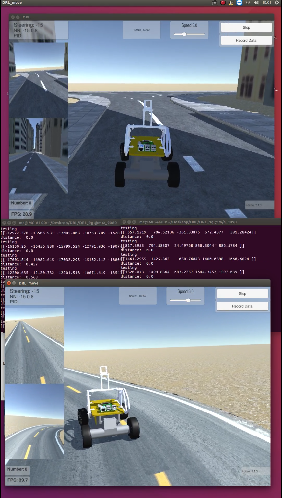

# Reinforcement Learning Self-Driving Car

## Introduction

This project implemented a self-driving car in our simulator using reinforcement learning. The car is able to drive freely and stably in different scenes with or without random barriers. We didn't collect any dataset and train the model ourselves, instead we defined actions and corresponding rewards for the car and let it learn itself from exploring. 

The simulator is upgrading everyday, more scenes and functions are being added. Locating and navigation will be added soon.  

## Installation

### Homebrew
ruby -e "$(curl -fsSL https://raw.githubusercontent.com/Homebrew/install/master/install)"
### OpenAI Gym dependencies
`brew install cmake boost boost-python sdl2 swig wget`
### noti
`(curl -L https://github.com/variadico/noti/releases/download/v2.5.0/noti2.5.0.darwin-amd64.tar.gz | tar -xz); sudo mv noti /usr/local/bin/`
### Node >= v7.0
`brew install node`

### Project Dependencies
`./bin/copy-config
 npm install; sudo npm I -g grunt-cli`

`conda env create -f environment.yml
 source activate DRL`

## Background

Reinforcement learning develops control patterns by providing feedback on a model’s selected actions, which encourages the model to select better actions in the future. At each time step, given some state s, the model will select an action a, and then observe the new state s' and a reward r based on some optimality criterion.

We specifically used a method known as Q learning, which approximates the maximum expected return for performing an action at a given state using an action-value (Q) function. Specifically, return gives the sum of the rewards until the game terminates, where the reward is discounted by a factor of γ at each time step. We formally define this as:

")

We then define the action-value function:

")

Note that if the optimal Q function is known for state s', we can write the optimal Q function at preceding state s as the maximum expected value of . This identity is known as the Bellman equation:

")

The intuition behind reinforcement learning is to continually update the action-value function based on observations using the Bellman equation. It has been shown by Sutton et al 1998 [2] that such update algorithms will converge on the optimal action-value function as time approaches infinity. Based on this, we can define Q as the output of a neural network, which has weights θ, and train this network by minimizing the following loss function at each iteration i:

")

Where y_i represents the target function we want to approach during each iteration. It is defined as:

")

Note that when i is equal to the final iteration of an episode (colloquially the end of a game), the Q function should be 0 since it is impossible to attain additional reward after the game has ended. Therefore, when i equals the terminal frame of an episode, we can simply write:

") 
 
## Definition  

Actions: 

- 0: do nothing
- 1: Accelerate 
- 2: Decelerate 
- 3: Turn Left
- 4: Turn Right 

We train the network with these actions. In order to communicate with simulator, we covert them to car's throttle and steering wheel. 

~~~python
if action == -1 or action == 0:
	steering_angle_a = 0
	throttle_a = 0
	data = {'steering_angle':steering_angle_a.__str__(), 'throttle': throttle_a.__str__()}
	
elif action == 1:
	data = {'throttle':'0.8', 'steering_angle':'0'}
elif action == 2:
	data = {'throttle':'-0.8', 'steering_angle':'0'} 
elif action == 3:
	data = {'steering_angle':'-15', 'throttle':'0.8'} 
elif action == 4:
	data = {'steering_angle':'15', 'throttle':'0.8'} 

Reward: 

reward = speed_vehicle / 10
reward_bad = -500000
reward -= abs(dist_path) * 10

###### Q Mark ########## 
if action_old_index == 1:
	reward += 1
elif action_old_index == 2:
	reward -= 5
elif action_old_index == 3:
	reward -= 1
elif action_old_index == 4:
	reward -= 1

	
If terminated:
	reward -= 500
~~~

Our goal is to make a self-driving car. But what we want is not only driving without hitting the wall, stable and comfortable are also preferred. So every action like turning and decelerating would get a small minus reward. Accelerate is preferred so we give it +1. Hitting the wall is the top 1 thing to be avoid. So we give it -10.  

State: 
The state is the current image from front camera and the speed. 

## Usage

1. Set up simulator 
2. `python python DRLCar.py`

## Reference 

This project is greatly inspired by MLJejuCamp2017's project: 
[https://github.com/MLJejuCamp2017/DRL_based_SelfDrivingCarControl](https://github.com/MLJejuCamp2017/DRL_based_SelfDrivingCarControl)

## Contact

MakerColider

Shiyu Mou
shiyumou@usc.edu

 